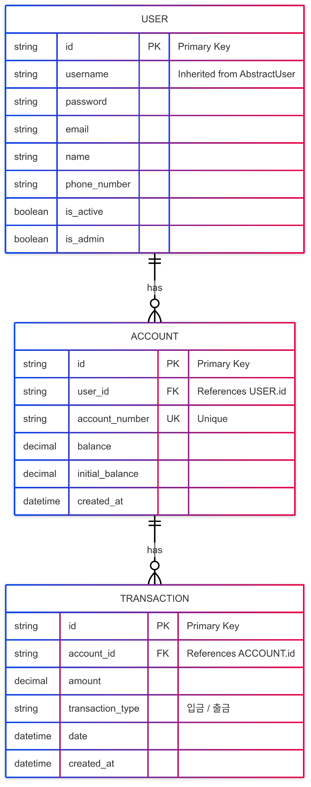

# 💳 계좌 거래 시스템 ERD 설명서

## 📌 ERD 개요

본 시스템은 세 가지 주요 엔티티로 구성되어 있습니다:  
**User (사용자), Account (계좌), Transaction (거래)**.  
사용자는 여러 개의 계좌를 생성할 수 있고, 계좌는 여러 건의 거래 정보를 포함합니다.  

ERD는 이러한 구조를 시각화하여 데이터베이스 설계의 흐름을 명확하게 보여줍니다.

---

## 👤 User 테이블

사용자 정보를 저장하는 테이블입니다.  
기본적으로 Django의 `AbstractUser`를 상속하여 `username`, `password`, `email` 등의 필드는 이미 내장되어 있으며, 다음과 같은 항목이 확장되어 포함됩니다:

- `name`: 사용자의 실명
- `phone_number`: 휴대폰 번호
- `is_active`: 계정 활성 여부 (기본값: True)
- `is_admin`: 관리자 여부 (기본값: False)

각 사용자는 하나의 고유 ID를 가지고 있으며, 이를 통해 계좌와 연결됩니다.

---

## 🏦 Account 테이블

사용자가 소유한 계좌 정보를 저장합니다.  
각 계좌는 다음과 같은 주요 정보를 포함합니다:

- `user_id`: 계좌 소유자 (User 테이블과 연결되는 외래키)
- `account_number`: 고유한 계좌번호 (중복 불가)
- `balance`: 현재 잔액
- `initial_balance`: 계좌 개설 당시의 초기 잔액
- `created_at`: 계좌 생성 일시

하나의 사용자(User)는 여러 개의 계좌(Account)를 가질 수 있습니다.

---

## 💰 Transaction 테이블

각 계좌에 대한 거래 기록을 저장하는 테이블입니다.  
하나의 계좌는 다양한 거래 내역을 가질 수 있으며, 다음 정보를 포함합니다:

- `account_id`: 거래가 발생한 계좌 (Account 테이블과 연결되는 외래키)
- `amount`: 거래 금액
- `transaction_type`: 입금(INCOME) 또는 출금(EXPENSE)
- `date`: 거래 발생 날짜
- `created_at`: 이 데이터가 DB에 기록된 날짜

입출금 유형은 시스템에서 정해진 ENUM 또는 ChoiceField로 구현될 수 있으며, 금융 내역 분석이나 통계 기능 확장 시 활용됩니다.

---

## 🔁 테이블 간 관계 요약

- `User` → `Account` : **1:N 관계**  
  하나의 사용자는 여러 개의 계좌를 보유할 수 있습니다.

- `Account` → `Transaction` : **1:N 관계**  
  하나의 계좌에서 여러 건의 거래가 발생할 수 있습니다.

---

## 🛠 기술 스택 및 도구

- **백엔드 프레임워크**: Django (Python)
- **ORM**: Django ORM
- **ERD 작성 도구**: ERDCloud  
- **DB**: SQLite (개발용) / PostgreSQL (운영 환경용 권장)

